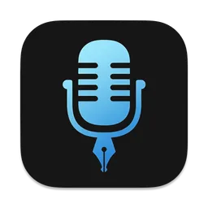

  
  <h1>VoiceInk 中文版</h1>
  
完全中文本地化的 macOS 语音转文字应用

  
  
  

---

## 📖 项目介绍

这是基于开源项目 [VoiceInk](https://github.com/Beingpax/VoiceInk) 的**完全中文本地化版本**。

**原项目来源**: [VoiceInk by Beingpax](https://tryvoiceink.com) - 一个优秀的 macOS 语音转文字应用，提供高精度的本地语音识别功能。

## 🇨🇳 中文本地化工作

本项目在原版基础上进行了**完整的中文本地化改造**：- **🔤 界面本地化**

- **💼 Pro版本配置**

### 直接使用

编译好的应用: **VoiceInk-CN.app** (包含在项目根目录)

- ✅ 完全中文界面
- ✅ Pro版本无限制
- ✅ 即开即用

### 自行编译

如需自行编译，请参阅 [BUILDING.md](BUILDING.md) 中的详细说明。

## ⚙️ 系统要求

- macOS 14.0 或更高版本

## 📄 开源协议

本项目基于 GNU General Public License v3.0 开源协议 - 详见 [LICENSE](LICENSE) 文件。

## 🙏 致谢

### 原项目

- **[VoiceInk](https://github.com/Beingpax/VoiceInk)** by Pax - 优秀的原始项目

### 核心技术

- [whisper.cpp](https://github.com/ggerganov/whisper.cpp) - OpenAI Whisper模型的高性能推理

### 重要依赖

- [Sparkle](https://github.com/sparkle-project/Sparkle) - 应用更新框架
- [KeyboardShortcuts](https://github.com/sindresorhus/KeyboardShortcuts) - 自定义快捷键
- [LaunchAtLogin](https://github.com/sindresorhus/LaunchAtLogin) - 开机启动功能
- [MediaRemoteAdapter](https://github.com/ejbills/mediaremote-adapter) - 媒体播放控制
- [Zip](https://github.com/marmelroy/Zip) - 文件压缩工具
